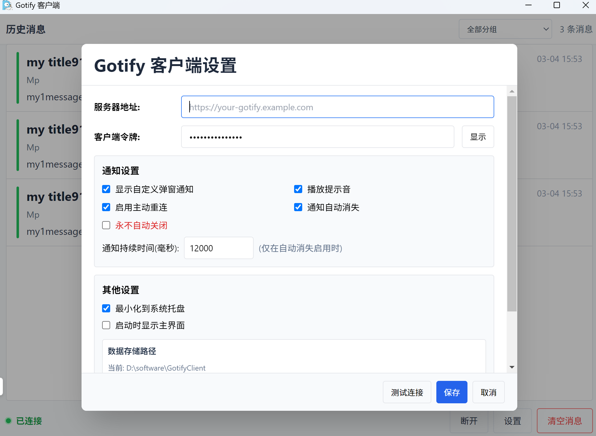

# Gotify PC 客户端




基于 Electron 的 Gotify 桌面客户端，支持实时消息接收、托盘驻留、自定义通知窗、历史消息持久化、Windows 安装包构建。

## 功能特性

- 实时 WebSocket 接收 Gotify 消息
- 自定义桌面通知窗（支持自动消失/常驻）
- **自动识别验证码**：消息中包含验证码时，通知弹窗显示“复制”按钮，一键复制验证码
- **智能通知交互**：鼠标悬停在通知弹窗上时自动暂停关闭倒计时
- 历史消息本地存储与清空
- 系统托盘菜单与最小化到托盘
- 设置页支持查看/修改数据存储路径
- 支持 Windows 免安装目录版与安装包构建

## 环境要求

- Node.js 18+
- Windows（当前构建脚本主要面向 Windows）

## 安装依赖

```bash
npm install
```

## 本地运行

```bash
npm start
```

## 常用脚本

- `npm run lint`：语法检查
- `npm run build:assets`：构建本地样式与渲染脚本（生成 `assets/tailwind.css` 与 `renderer.js`）
- `npm run pack`：构建目录版（默认输出到 `dist/win-unpacked`）
- `npm run repack`：一键结束占用进程并构建目录版（输出到 `dist-repack/<时间戳>/win-unpacked`）
- `npm run build:win`：构建 Windows 安装包（默认输出到 `dist/`）
- `npm run build:win:clean`：一键结束占用进程并构建安装包（输出到 `dist-installer/<时间戳>/`）

## 配置说明

首次启动后，可在设置页配置：

- 服务器地址（`serverUrl`）
- 客户端令牌（`clientToken`）
- 通知行为（自动消失、持续时间、是否播放提示音）
- 启动与托盘行为
- 数据存储路径

## 数据文件

默认会生成以下文件：

- `config.json`
- `message_history.json`

存储路径优先级：

1. 环境变量 `GOTIFY_DATA_DIR`
2. 设置页手动指定路径（已保存偏好）
3. 打包后 exe 同级目录
4. 开发环境项目目录
5. Electron `userData` 目录（兜底）

## 调试日志

启用主进程 WebSocket 调试日志：

```powershell
$env:GOTIFY_DEBUG_WS="1"
npm start
```

日志会输出连接、断开、重连、消息接收、重复消息丢弃等关键事件。

## 图标资源

- 运行时图标与页面图标使用：`defaultapp.png`
- 安装包图标使用：`../GotifyClient/gotify.ico`（通过 electron-builder 配置）

## 前端资源

- 渲染入口：`renderer.tsx`
- 构建输出：`renderer.js`
- 样式入口：`src/tailwind.css`
- 样式输出：`assets/tailwind.css`

## 打包产物路径

- 目录版：`dist-repack/<时间戳>/win-unpacked/`
- 安装包：`dist-installer/<时间戳>/GotifyClient Setup 0.1.0.exe`

## 常见问题

- 打包时报 `EBUSY` 文件占用：优先使用 `npm run repack` 或 `npm run build:win:clean`
- 运行时报 `Cannot find module 'ws'`：确认已执行 `npm install` 且 `ws` 在 `dependencies`
- 安装后无桌面图标：使用最新安装包（已启用 `createDesktopShortcut`）
